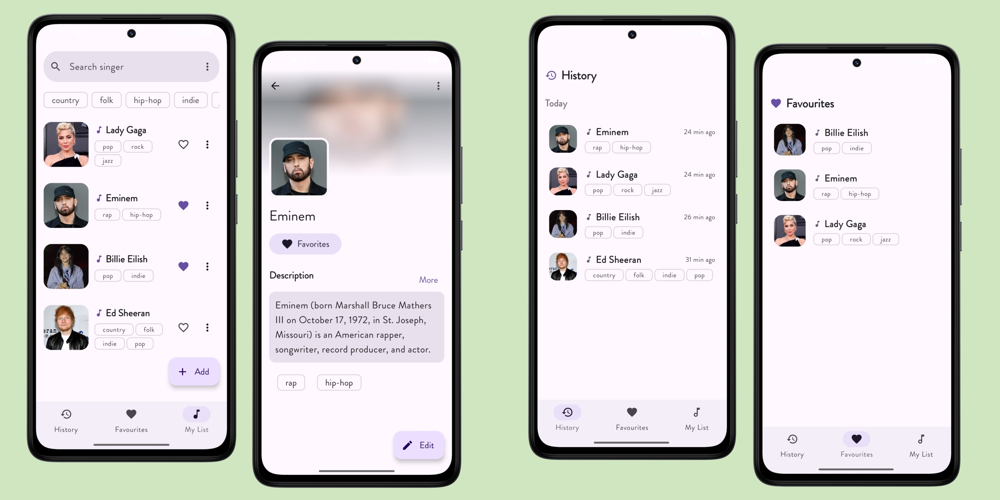

  

<h1 align="center">VoiceList 🎵</h1>

  
  

A small mobile development project built with **Kotlin** and **Jetpack Compose** to manage a personal list of singers.

## Preview

## Features

- Add, edit, and delete singers
- Search and filter by tag
- Mark favorites
- View history

## Stack

Kotlin, Jetpack Compose, Room (SQLite)

## License

MIT — see [LICENSE](./LICENSE).